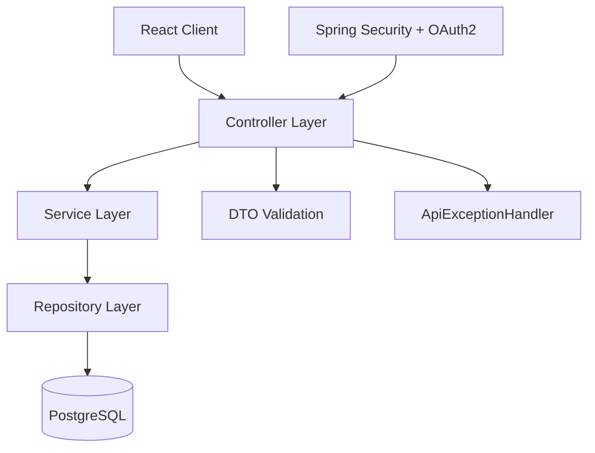
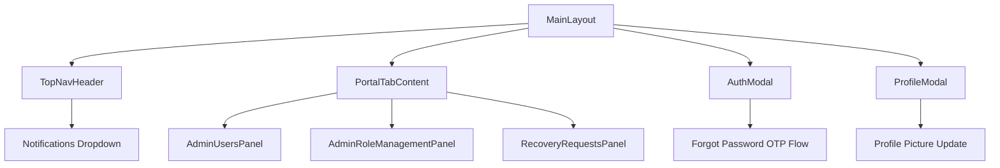
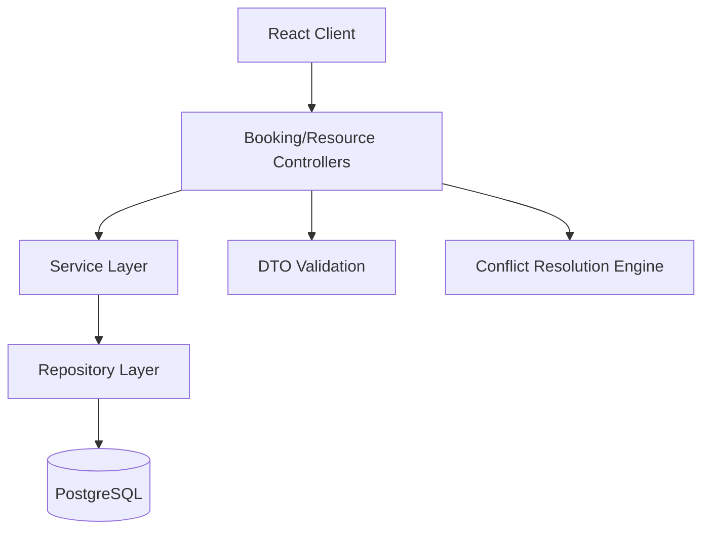
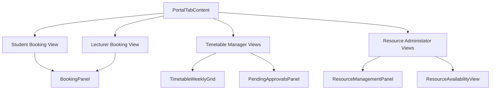
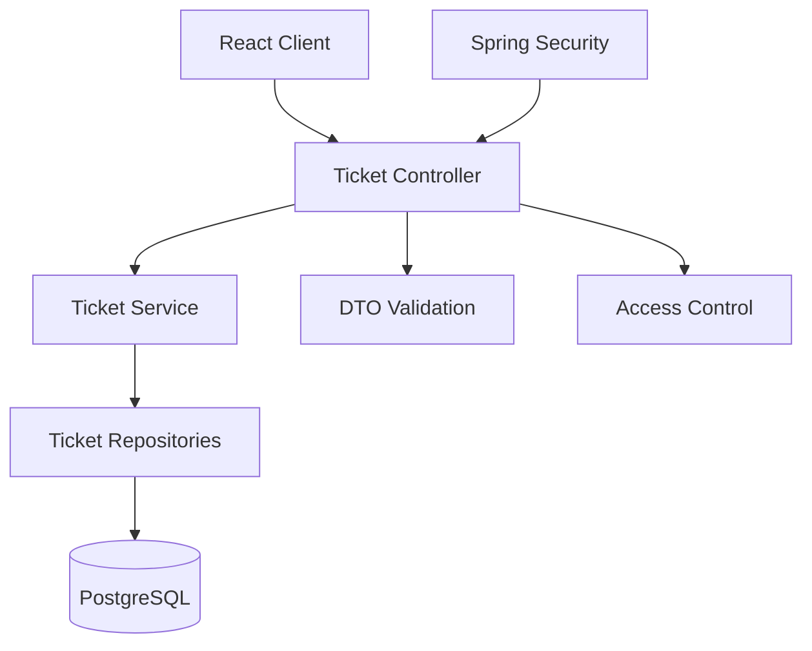
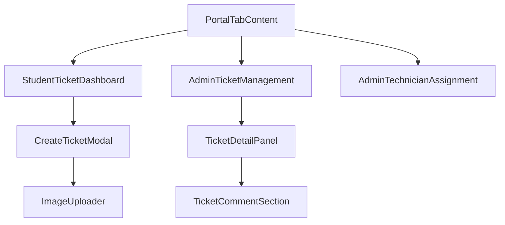

# Architecture Diagrams

> Working draft note: This file now includes the merged Member 3 ticketing architecture. Member 1 remains pending.

## Member 4 Architecture (Completed)

This section captures the architecture implemented for Member 4 features:
- OAuth authentication flow integration
- Notifications module
- Admin user/suspicious management support
- Account recovery workflow
- Profile picture update and rendering pipeline

## 1) Backend (Spring Boot) - Layered Architecture

### Member 4 backend components

- Controllers
	- AuthController
	- ActivationController
	- AdminController
	- NotificationController
	- RecoveryRequestController
- Services
	- ActivationService
	- NotificationService
	- RecoveryRequestService
	- PasswordResetService
	- ConsoleMailService / MailService
- Security
	- SmartCampusSecurityConfig
	- DatabaseBackedOAuth2UserService
	- DatabaseBackedOidcUserService
	- TemporaryPasswordExpiryFilter

## 2) Frontend (React) - Component Architecture

### Member 4 frontend responsibilities

- Navbar role-aware behavior and notification panel
- Auth modal with activation/forgot-password workflows
- Recovery request UI and admin actions
- Profile modal with photo upload and change-password entrypoint
- Admin activity list enhancements (avatar with fallback initials)

## 3) Data Model Additions (Member 4)

- `users.profile_picture_data_url` (V8)
- `users.temporary_password_hash` (V7)
- `users.temp_password_expires_at` (V7)
- `account_recovery_requests` table and indexes (V6)
- `notifications` table already used by Member 4 flows

## 4) Security and Access Notes

- Public endpoints: activation, login, forgot-password, recovery submission
- Protected endpoints: notifications, profile update
- Admin endpoints: user management, recovery approvals/rejections
- OAuth2 login configured with role-mapped access in security config

## 5) Quality and CI Notes (Member 4)

- Frontend CI now runs tests before build (`npm run test:run` then `npm run build`).
- Member 4 controller tests currently include:
	- `AuthControllerTest`
	- `NotificationControllerTest`
	- `RecoveryRequestControllerTest`
- Member 4 frontend tests currently include:
	- `authService.test.js`
	- `AdminUsersPanel.test.jsx`
- Stale/unrouted Member 4 duplicate files were removed to keep the page-first flow clean.

---

## Member 1 Architecture (Pending)

To be completed by Member 1.

## Member 2 Architecture (Completed)

This section captures the architecture designed for Member 2 features:
- Resource Booking Management with conflict-checking engine (409 Conflict handling)
- Official Timetable system with weekly grid views
- Role-specific dashboards for Students, Lecturers, Timetable Managers, and Resource Administators
- Pending request management and resource inventory/availability workflows

### 1) Backend (Spring Boot) - Layered Architecture

#### Member 2 backend components

- Controllers
	- BookingController
	- ResourceController
- Services
	- BookingService (handles schedule conflict logic)
	- ResourceService
- Data Models
	- Booking, Resource, BookingStatus
- Repositories
	- BookingRepository
	- ResourceRepository
- Migration
	- `V12__booking_enhancements.sql` for booking-purpose enhancements

### 2) Frontend (React) - Component Architecture

#### Member 2 frontend responsibilities

- Booking request form and booking history for students/lecturers.
- Weekly timetable grid with approved-slot rendering and week navigation.
- Pending booking approvals panel for timetable manager.
- Resource inventory CRUD and availability views for resource administator.
- Error handling for HTTP 409 conflicts during overlapping booking attempts.
## Member 3 Architecture (Completed)

This section captures the architecture implemented for the maintenance and incident ticketing module.

### 1) Backend (Spring Boot) - Layered Architecture

#### Member 3 backend components

- Controllers
	- TicketController
- Services
	- TicketService
- Data Models
	- IncidentTicket
	- TicketComment
	- TicketAttachment
	- TicketStatus
	- TicketPriority
	- TicketCategory
- Repositories
	- IncidentTicketRepository
	- TicketCommentRepository
	- TicketAttachmentRepository
- DTOs
	- CreateTicketRequest
	- UpdateTicketStatusRequest
	- AssignTechnicianRequest
	- AddCommentRequest
	- UpdateCommentRequest
	- TicketResponse
	- TicketSummaryResponse
	- CommentResponse
	- TicketMessageResponse

### 2) Frontend (React) - Component Architecture

#### Member 3 frontend responsibilities

- Student ticket dashboard for creating, filtering, and tracking personal tickets.
- Admin ticket management table with status counts, search, and delete actions.
- Technician assignment workflow for privileged users.
- Ticket detail panel with status transitions, rejection/resolution notes, attachments, and comments.
- Supporting badges and modal components for a consistent ticketing UI.

### 3) Data Model Additions (Member 3)

- `incident_tickets`
- `ticket_comments`
- `ticket_attachments`
- `TICKET_ADMINISTRATOR` role support for privileged ticket operations

### 4) Security and Access Notes

- Public ticket creation is not used; users must be authenticated to work with ticket endpoints.
- Ticket reporters can view and edit their own open tickets.
- Assigned technicians can view their assigned tickets.
- Ticket Administrator can list all tickets, assign technicians, update status, and delete tickets/comments.

### 5) Quality and CI Notes (Member 3)

- Frontend ticketing components were restyled to match the shared portal theme used by Members 2 and 4.
- Frontend build passes after the Member 3 UI refresh.
- The ticketing module uses reusable status and priority badges plus a scrollable create-ticket modal.

