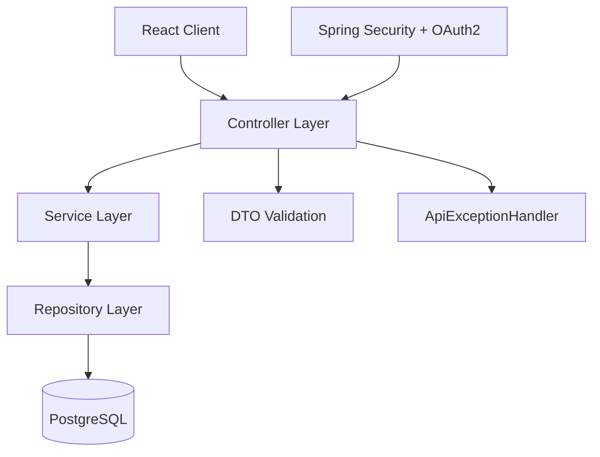
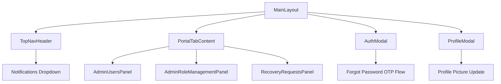
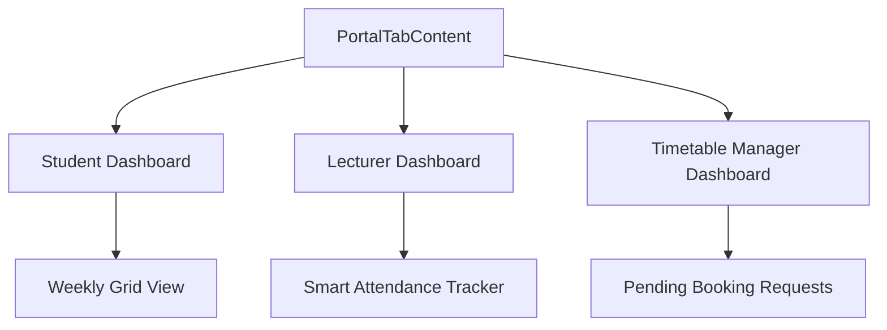

# Architecture Diagrams

> Working draft note: This file is currently Member-4-first and will be expanded with Member 1/2/3 architecture when their modules are merged.

## Member 4 Architecture (Completed)

This section captures the architecture implemented for Member 4 features:
- OAuth authentication flow integration
- Notifications module
- Admin user/suspicious management support
- Account recovery workflow
- Profile picture update and rendering pipeline

## 1) Backend (Spring Boot) - Layered Architecture

### Member 4 backend components

- Controllers
	- AuthController
	- ActivationController
	- AdminController
	- NotificationController
	- RecoveryRequestController
- Services
	- ActivationService
	- NotificationService
	- RecoveryRequestService
	- PasswordResetService
	- ConsoleMailService / MailService
- Security
	- SmartCampusSecurityConfig
	- DatabaseBackedOAuth2UserService
	- DatabaseBackedOidcUserService
	- TemporaryPasswordExpiryFilter

## 2) Frontend (React) - Component Architecture

### Member 4 frontend responsibilities

- Navbar role-aware behavior and notification panel
- Auth modal with activation/forgot-password workflows
- Recovery request UI and admin actions
- Profile modal with photo upload and change-password entrypoint
- Admin activity list enhancements (avatar with fallback initials)

## 3) Data Model Additions (Member 4)

- `users.profile_picture_data_url` (V8)
- `users.temporary_password_hash` (V7)
- `users.temp_password_expires_at` (V7)
- `account_recovery_requests` table and indexes (V6)
- `notifications` table already used by Member 4 flows

## 4) Security and Access Notes

- Public endpoints: activation, login, forgot-password, recovery submission
- Protected endpoints: notifications, profile update
- Admin endpoints: user management, recovery approvals/rejections
- OAuth2 login configured with role-mapped access in security config

## 5) Quality and CI Notes (Member 4)

- Frontend CI now runs tests before build (`npm run test:run` then `npm run build`).
- Member 4 controller tests currently include:
	- `AuthControllerTest`
	- `NotificationControllerTest`
	- `RecoveryRequestControllerTest`
- Member 4 frontend tests currently include:
	- `authService.test.js`
	- `AdminUsersPanel.test.jsx`
- Stale/unrouted Member 4 duplicate files were removed to keep the page-first flow clean.

---

## Remaining Team Architecture Sections

Member 1, Member 2, and Member 3 architecture diagrams can be appended after this section.

## Member 1 Architecture (Pending)

To be completed by Member 1.

## Member 2 Architecture (Completed)

This section captures the architecture designed for Member 2 features:
- Resource Booking Management with conflict-checking engine (409 Conflict handling)
- Official Timetable system with weekly grid views
- Role-specific dashboards for Lecturers, Students, and Timetable Managers
- Pending request management and smart attendance tracking

### 1) Backend (Spring Boot) - Layered Architecture

#### Member 2 backend components

- Controllers
	- BookingController
	- TimetableController
	- AttendanceController
	- ResourceController
- Services
	- BookingService (handles schedule conflict logic)
	- TimetableService
	- AttendanceService
- Data Models
	- Bookings, Resources, Timetables, Attendances (Schemas defined in `copythis*.sql`)

### 2) Frontend (React) - Component Architecture

#### Member 2 frontend responsibilities

- Role-specific dashboards with quick actions.
- Interactive weekly grid views for checking available slots.
- Form processing for safe concurrency/bookings.
- Error handling specifically for HTTP 409 Conflicts during simultaneous bookings.
## Member 3 Architecture (Pending)

To be completed by Member 3.

